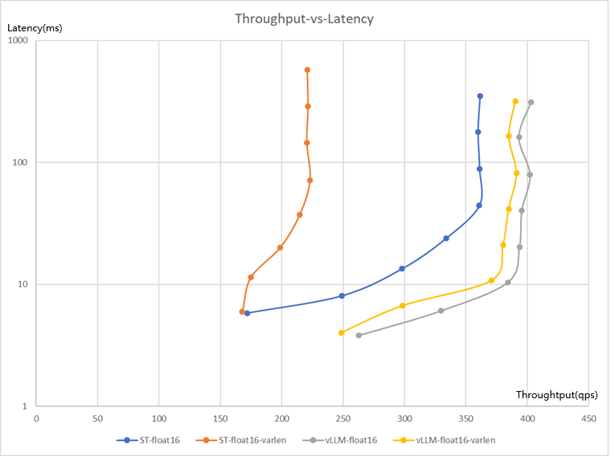

## vLLM

!!! note
    vLLM currently supports only a limited number of models, and many implementations have subtle differences compared to the default implementations in mteb (see the [overview issue](add me) for more information). For the full list of supported models, refer to the [vllm documentation](https://docs.vllm.ai/en/stable/models/supported_models/#pooling-models).


## Installation

If you're using cuda you can run
=== "pip"
    ```bash
    pip install "mteb[vllm]"
    ```
=== "uv"
    ```bash
    uv pip install "mteb[vllm]"
    ```

For other architectures, please refer to the [vllm installation guide](https://docs.vllm.ai/en/latest/getting_started/installation/).
## Usage

To use vLLM with MTEB you have to wrap the model with its respective wrapper.

!!! note
    you must update your Python code to guard usage of vllm behind a if __name__ == '__main__': block. For example, instead of this:
    
    ```python
    import vllm
    
    llm = vllm.LLM(...)
    ```
    try this instead:
    ```python
    if __name__ == '__main__':
        import vllm
    
        llm = vllm.LLM(...)
    ```

    See more [troubleshooting](https://docs.vllm.ai/en/latest/usage/troubleshooting/#python-multiprocessing)

=== "Embedding models"
    ```python
    import mteb
    from mteb.models.vllm_wrapper import VllmEncoderWrapper

    def run_vllm_encoder():
        """Evaluate a model on specified MTEB tasks using vLLM for inference."""
        encoder = VllmEncoderWrapper(model="intfloat/e5-small")
        return mteb.evaluate(
            encoder,
            mteb.get_task("STS12"),
        )

    if __name__ == "__main__":
        results = run_vllm_encoder()
        print(results)
    ```
=== "Reranking models"
    ```python
    import mteb
    from mteb.models.vllm_wrapper import VllmCrossEncoderWrapper

    def run_vllm_crossencoder():
        """Evaluate a model on specified MTEB tasks using vLLM for inference."""
        cross_encoder = VllmCrossEncoderWrapper(model="cross-encoder/ms-marco-MiniLM-L-6-v2")
        return mteb.evaluate(
            cross_encoder,
            mteb.get_task("AskUbuntuDupQuestions"),
        )


    if __name__ == "__main__":
        results = run_vllm_crossencoder()
        print(results)
    ```

## Why is vLLM fast?

### Half-Precision Inference

By default, vLLM uses Flash Attention, which only supports float16 and bfloat16 but not float32. vLLM does not optimize inference performance for float32.

<figure markdown="span">
    
    <figcaption>The throughput using float16 is approximately four times that of float32.
ST: using sentence transformers backend
vLLM: using vLLM backend
X-axis: Throughput (request/s)
Y-axis: Latency, Time needed for one step (ms) <- logarithmic scale
The curve lower right is better ↘
</figcaption>
</figure>


!!! note

    | Format   | Bits | Exponent | Fraction |
    |----------|------|----------|----------|
    | float32  | 32   | 8        | 23       |
    | float16  | 16   | 5        | 10       |
    | bfloat16 | 16   | 8        | 7        |

    If the model weights are stored in float32:

    - VLLM uses float16 for inference by default to inference a float32 model, it will keep numerical precision in most cases, for it have retains relatively more Fraction bits. However, due to the smaller Exponent part (only 5 bits), some models (e.g., the Gemma family) may risk producing NaN. VLLM maintains a list models that may cause NaN values and uses bfloat16 for inference by default.
    - Using bfloat16 for inference avoids NaN risks because its Exponent part matches float32 with 8 bits. However, with only 7 Fraction bits, numerical precision decreases noticeably.
    - Using float32 for inference incurs no precision loss but is about four times slower than float16/bfloat16.

    If model weights are stored in float16 or bfloat16, vLLM defaults to using the original dtype for inference.

    Quantization: With the advancement of open-source large models, fine-tuning of larger models for tasks like embedding and reranking is increasing. Exploring quantization methods to accelerate inference and reduce GPU memory usage may become necessary.


### Unpadding

By default, Sentence Transformers (st) pads all inputs in a batch to the length of the longest one, which is undoubtedly very inefficient. VLLM avoids padding entirely during inference.

<figure markdown="span">
    
    <figcaption>X-axis: Throughput (request/s)
ST: using sentence transformers
vLLM: using vLLM
Y-axis: Latency, Time needed for one step (ms) <- logarithmic scale
The curve lower right is better ↘
</figcaption>
</figure>


Sentence Transformers (st) suffers a noticeable drop in speed when handling requests with varied input lengths, whereas vLLM does not.

### Others

For models using bidirectional attention, such as BERT, VLLM offers a range of performance optimizations:

- Optimized CUDA kernels, including FlashAttention and FlashInfer integration
- CUDA Graphs and `torch.compile` support to reduce overhead and accelerate execution
- Support for tensor, pipeline, data, and expert parallelism for distributed inference
- Multiple quantization schemes—GPTQ, AWQ, AutoRound, INT4, INT8, and FP8—for efficient deployment
- Continuous batching of incoming requests to maximize throughput

For causal attention models, such as the Qwen3 reranker, the following optimizations are also applicable:

- Efficient KV cache memory management via PagedAttention
- Chunked prefill for improved memory handling during long-context processing
- Prefix caching to accelerate repeated prompt processing

vLLM’s optimizations are primarily designed for and most effective with causal language models (generative models). For the full list of features, refer to the [vllm documentation](https://docs.vllm.ai/en/latest/features/).


## API Reference


:::mteb.models.vllm_wrapper.VllmWrapperBase

!!! info
    For all vLLM parameters, please refer to https://docs.vllm.ai/en/latest/configuration/engine_args/.

:::mteb.models.vllm_wrapper.VllmEncoderWrapper

:::mteb.models.vllm_wrapper.VllmCrossEncoderWrapper
