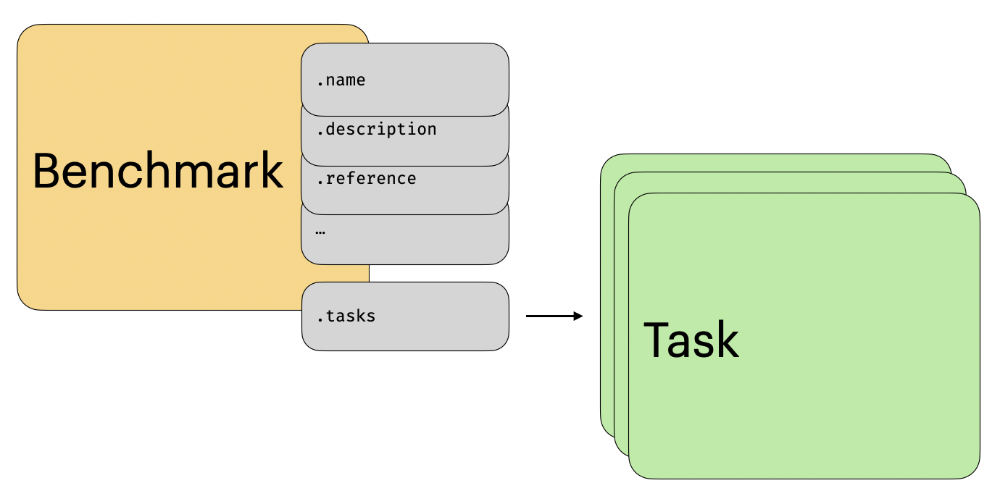

# Benchmark

A benchmark within `mteb` is essentially just a list of tasks along with some metadata about the benchmark.


<figure markdown="span">
    { width="80%" }
    <figcaption>An overview of the benchmark within `mteb`</figcaption>
</figure>

This metadata includes a short description of the benchmark's intention, the reference, and the citation. If you use a benchmark from `mteb`, we recommend that you cite it along with `mteb`.


## Utilities

:::mteb.get_benchmarks

:::mteb.get_benchmark


## The Benchmark Object

:::mteb.Benchmark


## Rank stability

A benchmark score is a mean over the tasks that happen to be in the suite, and a
ranking built from it can move when that suite does. `bootstrap_rank_stability`
resamples the tasks — one draw shared by every model, so comparisons stay paired
— and reports which parts of the ordering survive.

```python
import mteb
from mteb.benchmarks.rank_stability import bootstrap_rank_stability

benchmark = mteb.get_benchmark("MTEB(eng, v2)")
wide = benchmark.load_results().to_dataframe(format="wide")

report = bootstrap_rank_stability(wide)
report.summary.head()  # mean + interval, rank + rank interval
report.distinguishable_pairs()  # the comparisons the benchmark actually supports
```

Read a comparison off `win_probability`, not off whether two intervals in
`summary` overlap: the intervals are marginal, while the resample is paired, so
overlapping intervals routinely hide a difference that holds on every resample.

:::mteb.benchmarks.rank_stability.bootstrap_rank_stability

:::mteb.benchmarks.rank_stability.RankStabilityReport
