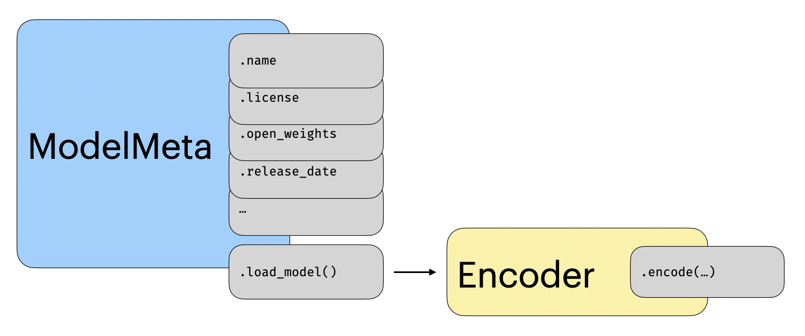

# Models

<!-- TODO: Encoder or model? Encoder is consistent with the code, but might be less used WDYT? We also use ModelMeta ... -->

A model in `mteb` cover two concept, its metadata and its implementation. The metadata contains information about the model such as maximum input
length, valid frameworks, license and degree of openness. The implementation, is simply a reproducible workflow which allows other to run the
exact model again using the same prompts, hyperparameters, aggregation strategies and so on.

## Metadata

:::mteb.models.ModelMeta

## The Encoder Interface

:::mteb.Encoder

