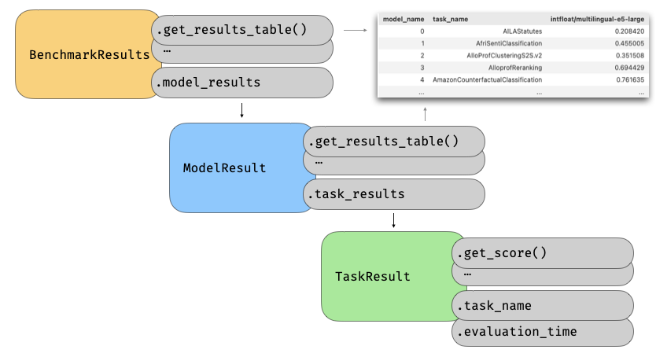

# Results

When a models is evaluated in MTEB it produces results. These results consist of:

- `TaskResult`: Result for a single task
- `ModelResult`: Result for a model on a set of tasks
- `BenchmarkResults`: Result for a set of models on a set of tasks



In normal use these come up when running a model:
```python
# ...
models_results = mteb.evaluate(model, tasks)
type(models_results) # mteb.results.ModelResults

task_result = models_results.task_results
type(models_results) # mteb.results.TaskResult
```

## Results cache

:::mteb.cache.ResultCache

## Result Objects

:::mteb.results.TaskResult

:::mteb.results.ModelResult

:::mteb.results.BenchmarkResults

## Timing and Phase Plotting

To analyze where evaluation time is spent, you can inspect the evaluation phases. The timing data is stored inside `TaskResult.evaluation_phases` as a list of `PhaseTiming` objects, and can be plotted directly using the `TaskResult.plot_evaluation_phases()` method.

<details>
<summary><b>Example: Inspecting and Plotting Runtime Timings</b> (click to expand)</summary>

```python
import mteb

model = mteb.get_model("sentence-transformers/all-MiniLM-L6-v2")
task = mteb.get_task("SciFact")

# Evaluate returns a ModelResult container holding TaskResult instances
results = mteb.evaluate(model, task)
task_result = results.task_results[0]

# Print the overall evaluation time
print(f"Evaluation took: {task_result.evaluation_time:.2f}s")

# Plot the timings from the cached results
task_result.plot_evaluation_phases()
```

This will print a text-based Gantt chart of the recorded evaluation phases:

```text
Data loading                     |███████████████████████████████                   | 19.4s
Dataset transform                |                               █                  | 0.0s

Encoding corpus (test, default)  |                               █                  | 0.0s
Encoding queries (test, default) |                               ██████████████████ | 11.1s
Scoring (test, default)          |                                                 █| 0.1s
                                  30.6s (untracked: 0.0s)
```
</details>
