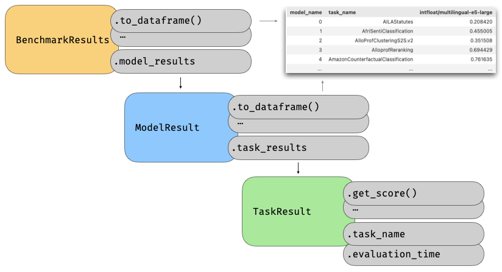

# Results

When a models is evaluated in MTEB it produces results. These results consist of:

- `TaskResult`: Result for a single task
- `ModelResult`: Result for a model on a set of tasks
- `BenchmarkResults`: Result for a set of models on a set of tasks



In normal use these come up when running a model:
```python
# ...
models_results = mteb.evaluate(model, tasks)
type(models_results) # mteb.results.ModelResults

task_result = models_results.task_results
type(models_results) # mteb.results.TaskResult
```

## Results cache

:::mteb.cache.ResultCache

## Result Objects

:::mteb.results.TaskResult

:::mteb.results.ModelResult

:::mteb.results.BenchmarkResults
