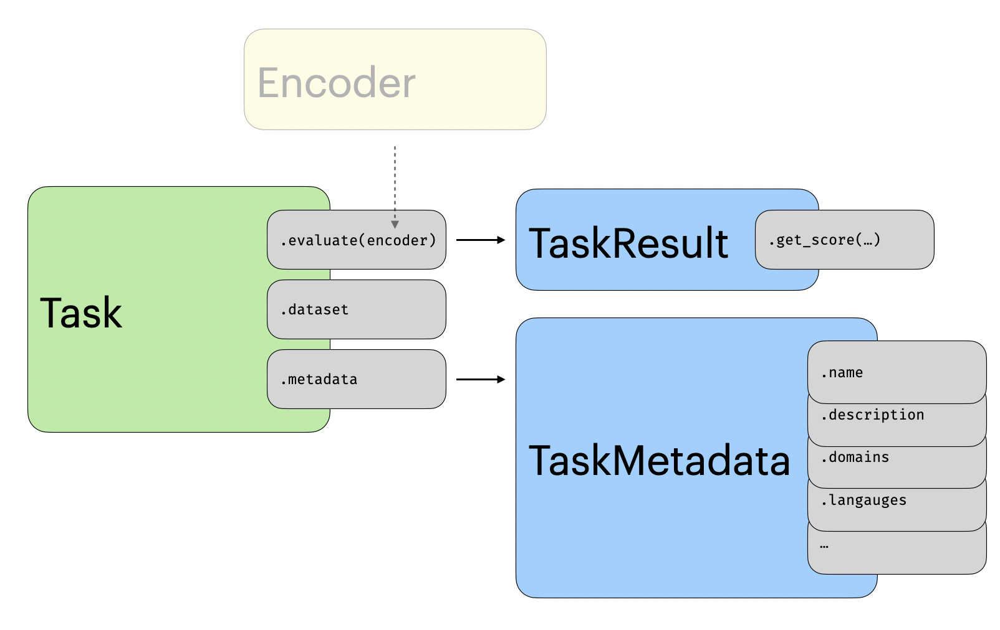

# Tasks

A task is an implementation of a dataset for evaluation. It could, for instance, be the MIRACL dataset consisting of queries, a corpus of documents 
,and the correct documents to retrieve for a given query. In addition to the dataset, a task includes the specifications for how a model should be run on the dataset and how its output should be evaluated. Each task also comes with extensive metadata including the license, who annotated the data, etc.

<figure markdown="span">
    { width="80%" }
    <figcaption>An overview of the tasks within `mteb`</figcaption>
</figure>

## Utilities

:::mteb.get_tasks

:::mteb.get_task

## Metadata

Each task also contains extensive metadata. We annotate this using the following object, which allows us to use [pydantic](https://docs.pydantic.dev/latest/) to validate the metadata. 

:::mteb.TaskMetadata
    options:
      members: true

## The Task Object

All tasks in `mteb` inherits from the following abstract class.

:::mteb.AbsTask
<!-- 
TODO: we probably need to hide some of the method and potentially add a docstring to the class.
-->

