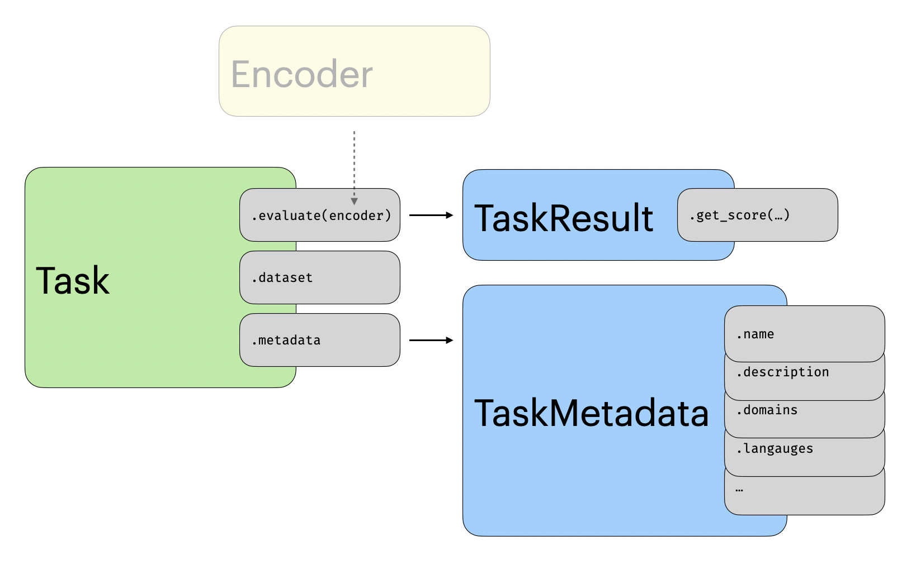

# Tasks

A task is an implementation of a dataset for evaluation. It could, for instance, be the MIRACL dataset consisting of queries, a corpus of documents
,and the correct documents to retrieve for a given query. In addition to the dataset, a task includes the specifications for how a model should be run on the dataset and how its output should be evaluated. Each task also comes with extensive metadata including the license, who annotated the data, etc.

<figure markdown="span">
    { width="80%" }
    <figcaption>An overview of the tasks within `mteb`</figcaption>
</figure>

## Utilities

:::mteb.get_tasks

:::mteb.get_task

:::mteb.filter_tasks

## Metadata

Each task also contains extensive metadata. We annotate this using the following object, which allows us to use [pydantic](https://docs.pydantic.dev/latest/) to validate the metadata.

:::mteb.TaskMetadata

## Metadata Types

:::mteb.abstasks.task_metadata.AnnotatorType

:::mteb.abstasks.task_metadata.SampleCreationMethod

:::mteb.abstasks.task_metadata.TaskCategory

:::mteb.abstasks.task_metadata.TaskDomain

:::mteb.abstasks.task_metadata.TaskType

:::mteb.abstasks.task_metadata.TaskSubtype

:::mteb.abstasks.task_metadata.PromptDict


## The Task Object

All tasks in `mteb` inherits from the following abstract class.


:::mteb.AbsTask

## Cleaning Task Data

Datasets often contain duplicated or near-empty documents. A task can remove those before it is evaluated:

```python
import mteb

task = mteb.get_task("MassiveIntentClassification")
task.remove_duplicates()
task.filter_short_documents(min_length=5)  # or min_length=3, unit="words"
```

Both methods load the data if needed, modify the dataset in place and return the task, so they can be chained.
They cover every split and subset by default; `splits=`, `subsets=` and `columns=` narrow that down. For retrieval
tasks the relevance judgements are kept valid: a judgement pointing at a removed duplicate moves to the copy that
was kept, and a query left without a positive is dropped.

Duplicates are texts that match once surrounding whitespace is stripped. `normalize=` loosens the comparison:

| `normalize` | additionally ignores | `"Wake me up!"` also matches |
|---|---|---|
| `"strip"` (default) | – | `"  Wake me up! "` |
| `"casefold"` | case | `"wake me up!"` |
| `"alphanumeric"` | punctuation, repeated whitespace | `"wake  me  up"` |

```python
task.remove_duplicates(normalize="alphanumeric")
```

Under `"alphanumeric"`, `"e-mail"` and `"email"` are duplicates too, but `"e mail"` is not. The looser settings
catch more duplicates while risking merges a reader would tell apart — punctuation matters in source code, and case
folding is not meaningful in every script.

A filter that removed something sets `task.data_modified`. While that is set, `mteb` does not read cached results
for the task and warns when a `TaskResult` is built. The filters also warn about data they leave unusable, such as
an emptied split.

!!! warning
    A cleaned task no longer matches the published dataset, so its scores are not comparable to the
    [leaderboard](https://huggingface.co/spaces/mteb/leaderboard) and its descriptive statistics still describe the
    published data. If a dataset needs cleaning for everyone, please
    [open an issue](https://github.com/embeddings-benchmark/mteb/issues) so a new version of the task can be created
    instead.

## Multimodal Tasks

Tasks that support any modality (text, image, etc.) inherit from the following abstract class. Retrieval tasks support multimodal input (e.g. image + text queries and image corpus or vice versa).

:::mteb.abstasks.retrieval.AbsTaskRetrieval

:::mteb.abstasks.retrieval_dataset_loaders.RetrievalSplitData
    options:
        show_root_toc_entry: false

:::mteb.abstasks.classification.AbsTaskClassification

:::mteb.abstasks.multilabel_classification.AbsTaskMultilabelClassification

:::mteb.abstasks.clustering.AbsTaskClustering

:::mteb.abstasks.sts.AbsTaskSTS

:::mteb.abstasks.zeroshot_classification.AbsTaskZeroShotClassification

:::mteb.abstasks.regression.AbsTaskRegression

:::mteb.abstasks.clustering_legacy.AbsTaskClusteringLegacy

## Text Tasks

:::mteb.abstasks.text.bitext_mining.AbsTaskBitextMining

:::mteb.abstasks.pair_classification.AbsTaskPairClassification

:::mteb.abstasks.text.summarization.AbsTaskSummarization

:::mteb.abstasks.text.reranking.AbsTaskReranking

## Image Tasks

:::mteb.abstasks.image.image_text_pair_classification.AbsTaskImageTextPairClassification
