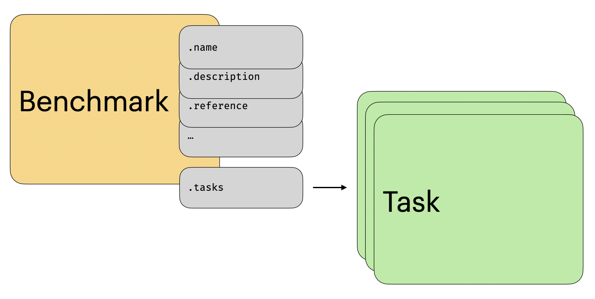
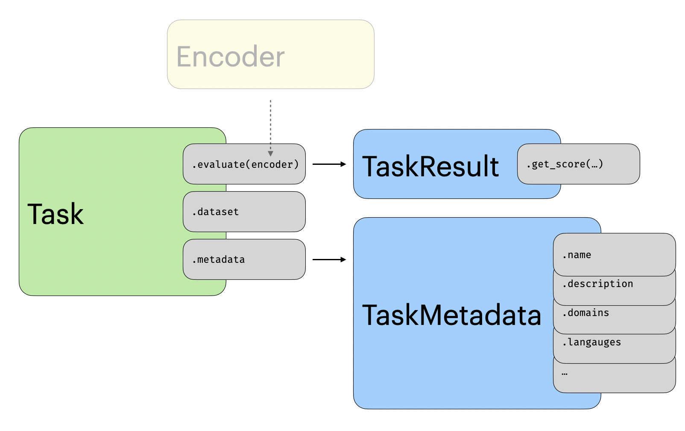
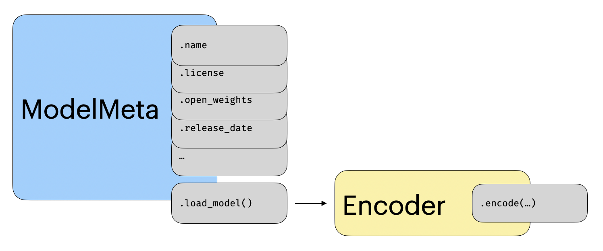

# Overview

This is the API documentation for `mteb` a package for benchmark and evaluating the quality of embeddings. 
This package was initially introduced as a package for evaluating text embeddings for English[@mteb_2023], but have since been extended cover multiple languages and multiple modalities.
<!-- TODO add [@mmteb_2025] [@mieb_2025]. --> 

# Package Overview
This package generally consists of three main concepts *benchmarks*, *tasks* and *model implementations*.

## Benchmarks

A benchmark is a tool to evaluate an embedding model for a given use case. For instance, `mteb(eng)` is intended 
to evaluate the quality of text embedding models for broad range of English use-cases such retrieval, classification, and reranking. 
A benchmark consist of a collection of tasks. When a model is run on a benchmark it is run on each task individually.

<figure markdown="span">
    { width="80%" }
    <figcaption>An overview of the benchmark within `mteb`</figcaption>
</figure>

## Task

A task is an implementation of a dataset for evaluation. It could for instance be the MIRACL dataset consisting of queries, a corpus of documents 
as well as the correct documents to retrieve for a given query. In addition to the dataset a task includes specification for how a model should be run on the dataset and how its output should be evaluation. We implement a variety of different tasks e.g. for evaluating classification, retrieval etc., We denote these [task categories](task.md#metadata). Each task also come with extensive [metadata](api/task.md#metadata) including the license, who annotated the data and so on.

<figure markdown="span">
    { width="80%" }
    <figcaption>An overview of the tasks within `mteb`</figcaption>
</figure>

## Model Implementation

A model implementation is simply an implementation of an embedding model or API to ensure that others can reproduce the *exact* results on a given task.
For instance, when running the OpenAI embedding API on a document larger than the maximum amount of tokens a user will have to decide how they want to
deal with this limitations (e.g. by truncating the sequence). Having a shared implementation allow us to examine these implementtion assumptions and allow
for reproducible workflow. To ensure consistency we define a [standard interface](api/model.md#the-encoder-interface) that models should follow to be implemented. These implementations additionally come with [metadata](api/model.md#metadata), that for exampe include license, compatible frameworks, and whether the weight are public or not.

<figure markdown="span">
    { width="80%" }
    <figcaption>An overview of the model and its metadata within `mteb`</figcaption>
</figure>

