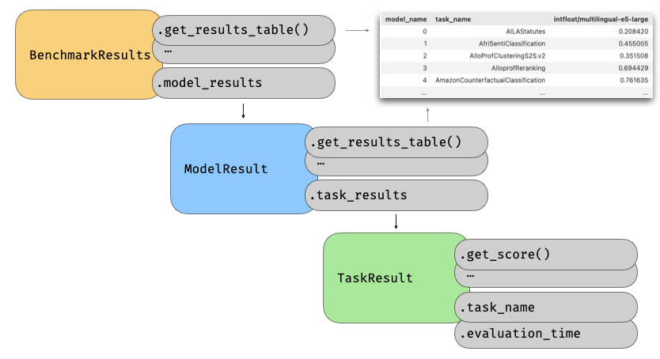

# Loading and working with results

To make the results more easily accessible, we have designed functionality for retrieving results from both online and the local cache.
Generally you access this functionality using the `ResultCache` object.

For instance, if you are selecting the best model for semantic text similarity (STS) you could fetch the relevant tasks and create a dataframe of the results using the following code:

```python
import mteb
from mteb.cache import ResultCache

tasks = mteb.get_tasks(tasks=["STS12"])
model_names = ["intfloat/multilingual-e5-large"]

cache = ResultCache("~/.cache/mteb")
results = cache.load_results(models=model_names, tasks=tasks)
```

From this you will get a `BenchmarkResults` object:
```python
results
# BenchmarkResults(model_results=[...](#1))
type(results)
# mteb.load_results.benchmark_results.BenchmarkResults
```
Which you can then convert to a dataframe:

```python
df = results.to_dataframe()
```

## Working with public results

All previously submitted results are available results [repository](https://github.com/embeddings-benchmark/results).

You can download this using:

```python
from mteb.cache import ResultCache

cache = ResultCache()
cache.download_from_remote() # download results from the remote repository
```

From here, you can work with the cache as usual. For instance, if you are selecting the best model for your French and English retrieval task on legal documents, you could fetch the relevant tasks and create a dataframe of the results using the following code:

```python
from mteb.cache import ResultCache

# select your tasks
tasks = mteb.get_tasks(task_types=["Retrieval"], languages=["eng", "fra"], domains=["Legal"])

model_names = [
    "GritLM/GritLM-7B",
    "intfloat/multilingual-e5-large",
]


cache = ResultCache()
cache.download_from_remote() # download results from the remote repository. Might take a while the first time.

results = cache.load_results(
    models=model_names,
    tasks=tasks,
    include_remote=True, # default
)
```

## Working with `BenchmarkResults`

The result object is a convenient object in `mteb` for working with dataframes and allows you to quick examine your results.



The object contain a lot of convenience functions for inspecting and examining the results:
```python
print(results.model_names)
# ['GritLM/GritLM-7B', 'intfloat/multilingual-e5-large']

task_names = results.task_names
print(task_names)
# ['SpartQA', 'PlscClusteringP2P.v2', 'StackOverflowQA', 'JSICK', ...
```

### Filtering Results

There is also utility function that allows you to select certain models or tasks:
```python
# select only gritLM
results = results.select_models(["GritLM/GritLM-7B"])

# select only retrieval tasks
tasks = mteb.get_tasks(tasks=task_names)
retrieval_tasks = [task for task in tasks if task.metadata.type == "Retrieval"]

results = results.select_tasks(retrieval_tasks)
```

### Creating a Dataframe

```python
df = results.to_dataframe()

print(df)
# model_name                        task_name  GritLM/GritLM-7B
# 0                              AILAStatutes          0.418000
# 1                                   ArguAna          0.631710
# 2                         BelebeleRetrieval          0.717035
# 3                            CovidRetrieval          0.734010
# 4                           HagridRetrieval          0.986730
# 5                      LEMBPasskeyRetrieval          0.382500
# 6               LegalBenchCorporateLobbying          0.949990
# 7              MIRACLRetrievalHardNegatives          0.516793
# 8                             MLQARetrieval          0.727420
# 9                                   SCIDOCS          0.244090
# 10                                  SpartQA          0.093550
# 11                          StackOverflowQA          0.933670
# 12          StatcanDialogueDatasetRetrieval          0.457587
# 13                                TRECCOVID          0.743130
# 14                             TempReasonL1          0.071640
# 15                   TwitterHjerneRetrieval          0.432660
# 16           WikipediaRetrievalMultilingual          0.917722
# 17                               WinoGrande          0.536970
```

By default this will give you the results in a `"wide"` format. However, you can just as well get them in a long format:

```python
long_format_df = results.to_dataframe(format="long")

print(long_format_df.head(5))
#          model_name          task_name     score
# 0  GritLM/GritLM-7B       AILAStatutes  0.418000
# 1  GritLM/GritLM-7B            ArguAna  0.631710
# 2  GritLM/GritLM-7B  BelebeleRetrieval  0.717035
# 3  GritLM/GritLM-7B     CovidRetrieval  0.734010
# 4  GritLM/GritLM-7B    HagridRetrieval  0.986730
```

### Adding metadata to table

One might want to add some more metadata to the table. This is luckily quite easy using:

```python
import pandas as pd

task_df = tasks.to_dataframe(properties=["name", "type", "domains"])
task_df = task_df.rename(columns={"name": "task_name"})

df_with_meta = pd.merge(task_df, df)

print(df_with_meta.head(5))
#            task_name       type                   domains  GritLM/GritLM-7B
# 0            SpartQA  Retrieval  [Encyclopaedic, Written]          0.093550
# 1    StackOverflowQA  Retrieval    [Programming, Written]          0.933670
# 2  BelebeleRetrieval  Retrieval      [Web, News, Written]          0.717035
# 3            ArguAna  Retrieval        [Medical, Written]          0.631710
# 4       TempReasonL1  Retrieval  [Encyclopaedic, Written]          0.071640
```
